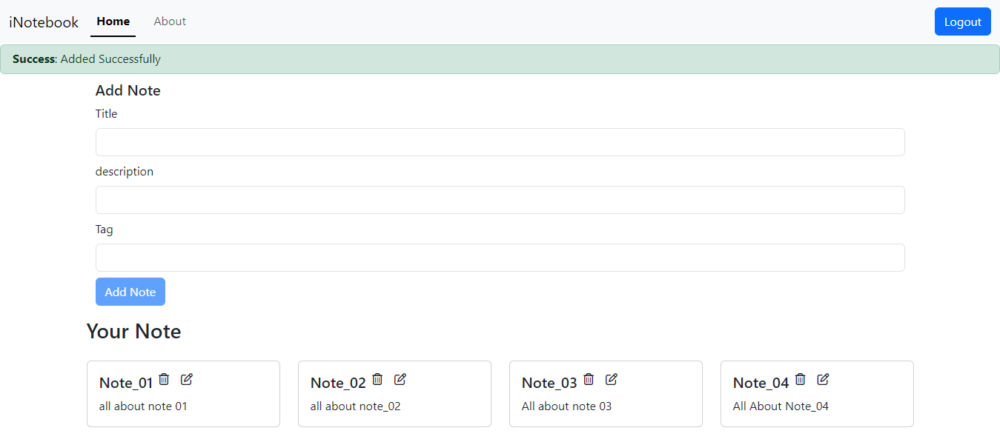
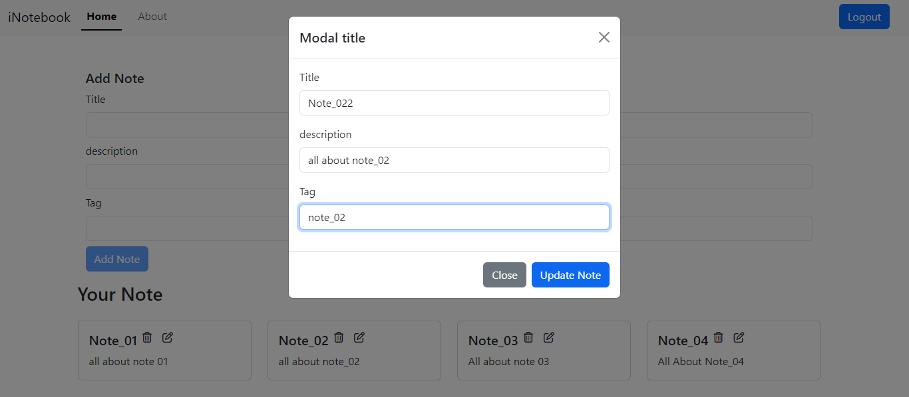

# iNotebook

iNotebook is a full-stack note-taking application that allows users to securely create, edit, and manage their personal notes. The project includes both frontend and backend components, with a focus on a seamless user experience and robust data security.

## Table of Contents

- [Features](#features)
- [Tech Stack](#tech-stack)
- [Installation](#installation)
- [Usage](#usage)
- [API Endpoints](#api-endpoints)
- [Screenshots](#screenshots)

## Features

- **User Authentication:** Secure login and registration functionality.
- **Note Management:** Users can create, edit, and delete their notes.
- **User-specific Data:** Each user's notes are accessible only to them; no one else can view or modify them.
- **Responsive UI:** A modern, user-friendly interface that works across different devices.
- **API Integration:** Backend API endpoints handle all user and note-related operations.

## Tech Stack

### Frontend
- **HTML5**
- **CSS3**
- **JavaScript (ES6+)**
- **React.js**

### Backend
- **Node.js**
- **Express.js**
- **MongoDB**

## Installation

### Prerequisites
- Node.js and npm installed on your system.
- MongoDB installed and running.

### Steps
1. **Clone the repository:**
    ```bash
    git clone https://github.com/68rajat68/iNotebook.git
    cd iNotebook
    ```

2. **Install backend dependencies:**
    ```bash
    cd backend
    npm install
    ```

3. **Install frontend dependencies:**
    ```bash
    cd ../frontend
    npm install
    ```

4. **Setup environment variables:**
    - Create a `.env` file in the backend directory.
    - Add the following variables:
      ```bash
      MONGO_URI=<your-mongodb-uri>
      JWT_SECRET=<your-jwt-secret>
      ```

5. **Run the application:**
    - Start the backend server:
      ```bash
      cd backend
      npm start
      ```
    - Start the frontend server:
      ```bash
      cd ../frontend
      npm start
      ```

6. **Open the application in your browser:**
    ```bash
    http://localhost:3000
    ```

## Usage

- **Login/Register:** Users must register an account or log in to access their notes.
- **Create Note:** After logging in, users can create a new note.
- **Edit Note:** Users can modify any of their existing notes.
- **Delete Note:** Users can delete any of their notes.

## API Endpoints

### User Authentication
- **POST** `/api/auth/createuser`: Create a new user.
- **POST** `/api/routes/auth/login`: Login with existing credentials.
- **POST** `/api/routes/auth/logout`: Logout the current user.

### Note Management
- **GET** `/api/notes/fetchallnotes`: Fetch all notes for the logged-in user.
- **POST** `/api/notes/addnote`: Add a new note.
- **PUT** `/api/notes/updatenote/:id`: Update an existing note.
- **DELETE** `/api/notes/deletenote/:id`: Delete a note.

## Screenshots
Some screenshots of iNotebook.

### SignUp Page


### Adding New Note


### Update Note



